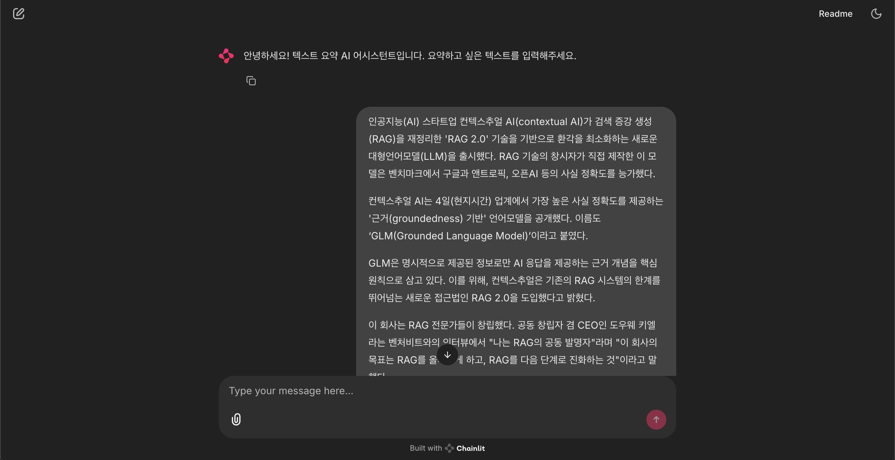
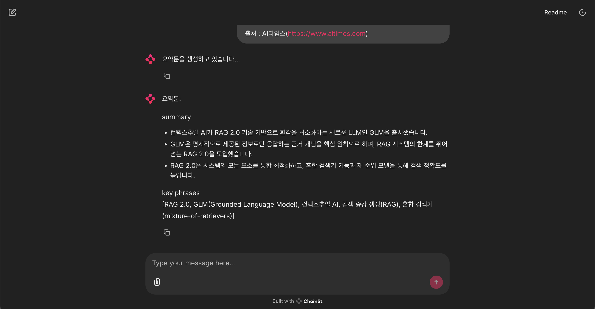
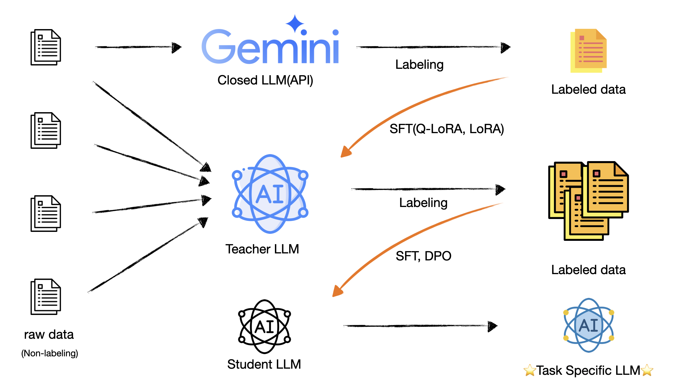

# sLLM Optimization through Knowledge Distillation

This project demonstrates an efficient approach to generating training datasets using Large Language Models (LLMs) and training smaller models with these datasets. It addresses the challenge of using high-performance LLMs in resource-constrained environments by generating high-quality training data with larger models and using it to optimize smaller, more deployable models.

## Demo page example




## Project Architecture


## Project Overview

The main components of this project are:

1. **Document Summarization**: Using large models (e.g., Gemini) to generate summaries of input documents.
2. **Model Training**: Training smaller models based on the generated summaries to improve performance.
3. **Model Testing**: Performing inference tasks (summarization) using the trained models and evaluating them.

## Requirements

- Python 3.10+
- Required environment variables: GEMINI_API_KEY, GEMINI_MODEL_NAME, NUM_SAMPLES

## Installation

1. Clone this repository:
   ```
   git clone https://github.com/yourusername/LLM_distillation.git
   cd LLM_distillation
   ```

2. Install required packages:
   ```
   pip install -r requirements.txt
   ```
   
3. Data preparation:
   - The column you want to use as text in your data should be named `text`.

4. Set up environment variables:
   Create a `.env` file with the following variables:
   ```
   GEMINI_API_KEY=your_api_key
   GEMINI_MODEL_NAME=gemini-flash-2.0
   NUM_SAMPLES=1000
   ```

## Usage

Run the main script `src/main.py` to execute the entire pipeline:

```
python src/main.py
```

This script performs the following steps:
1. Generate summaries using the Gemini API
2. Train Model A (Q-LoRA)
3. Generate summaries for the remaining data using vLLM
4. Train Model B
5. Evaluate the models

## Project Structure

```
LLM_distillation/
├── configs/                  # Configuration files
│   ├── student_model.yaml    # Student model training config
│   └── teacher_model.yaml    # Teacher model training config
├── data/                     # Data directory
│   ├── raw/                  # Raw data
│   ├── train/                # Training data
│   ├── test/                 # Test data
│   ├── gemini_summary/       # Summaries generated by Gemini
│   └── model_outputs/        # Model output results
├── models/                   # Saved model files
├── prompts/                  # Prompt templates
├── src/                      # Source code
│   ├── data/                 # Data processing code
│   ├── demo/                 # Demo application
│   ├── evaluation/           # Evaluation code
│   ├── models/               # Model-related code
│   ├── scripts/              # Execution scripts
│   ├── utils/                # Utility functions
│   └── main.py               # Main execution file
├── .env                      # Environment variables file
├── README.md                 # Project description
└── requirements.txt          # Required packages list
```

## Key Components

### 1. Data Processing (src/data/)
- Data loading and preprocessing
- Summary generation via Gemini API

### 2. Models (src/models/)
- Model training and fine-tuning
- Efficient training using Q-LoRA techniques

### 3. Evaluation (src/evaluation/)
- Performance evaluation of trained models
- Summary quality measurement

### 4. Utilities (src/utils/)
- Model loading and inference using vLLM
- Configuration file management

### 5. Demo (src/demo/)
- Demo application using the trained models

## 💫 Future Work

The following enhancements are planned for future releases:

1. **Direct Preference Optimization (DPO)**: Implement DPO training to further refine model outputs based on human preferences, improving the quality and alignment of generated summaries.

2. **Automatic Data Filtering**: Add intelligent data filtering capabilities to automatically identify and remove low-quality or irrelevant training examples, ensuring higher quality training data.


